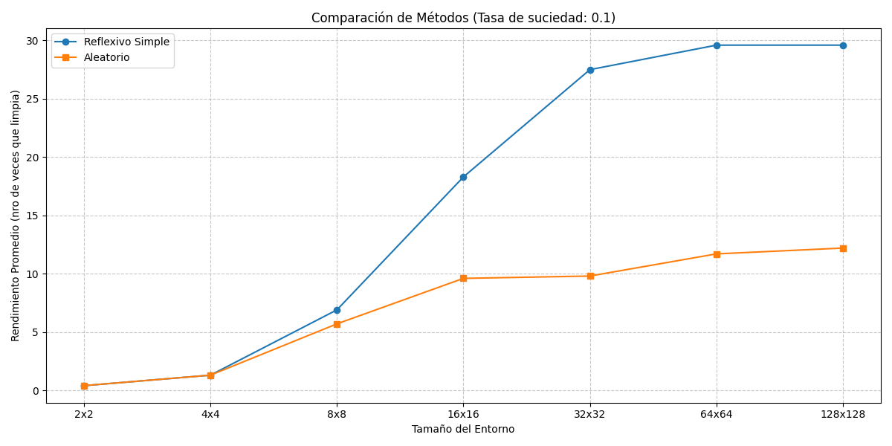
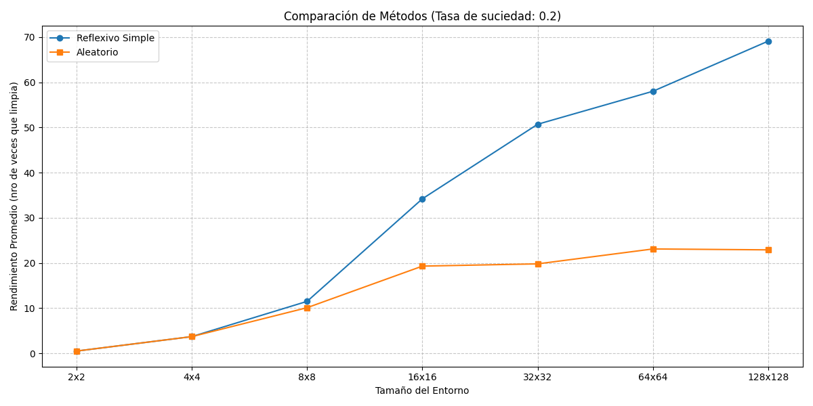
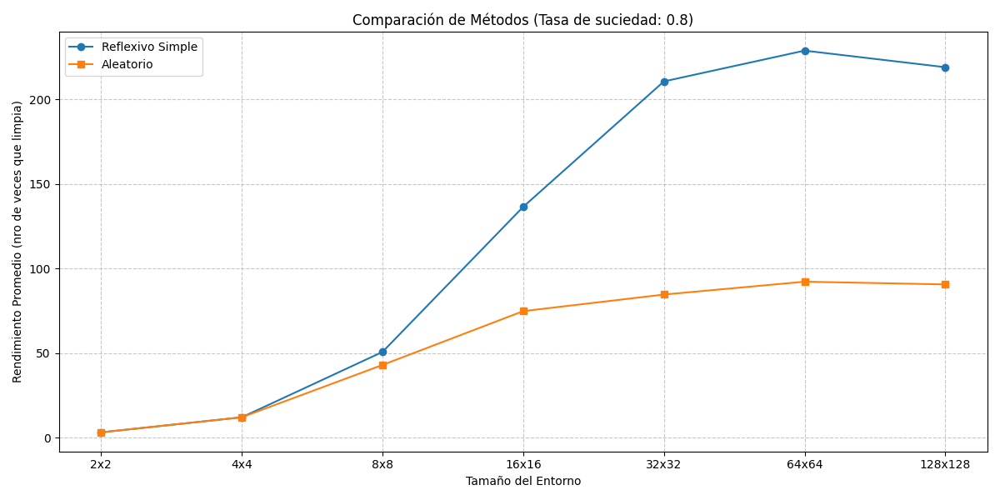
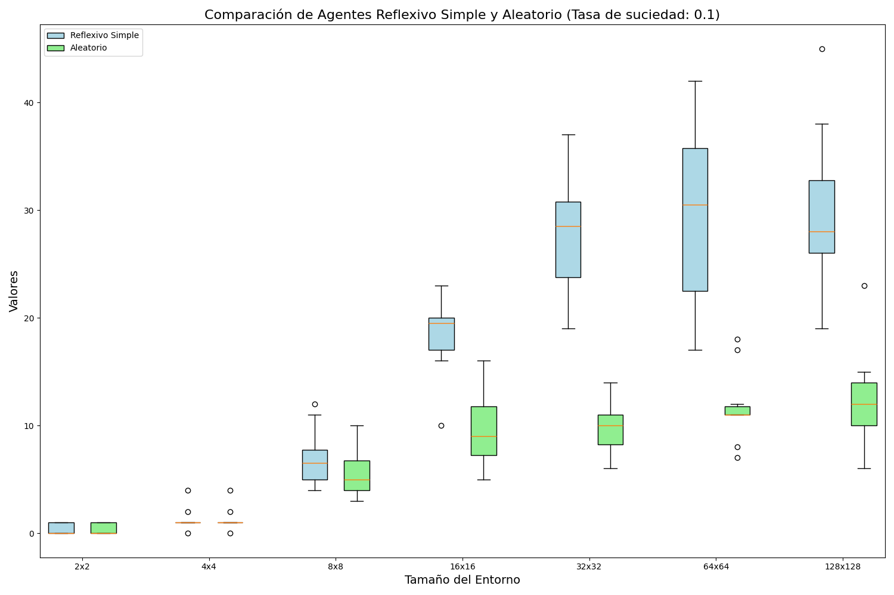
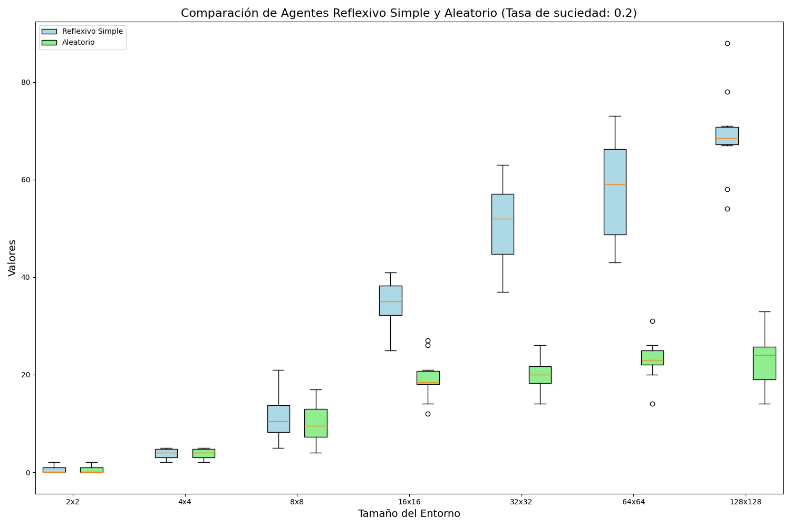
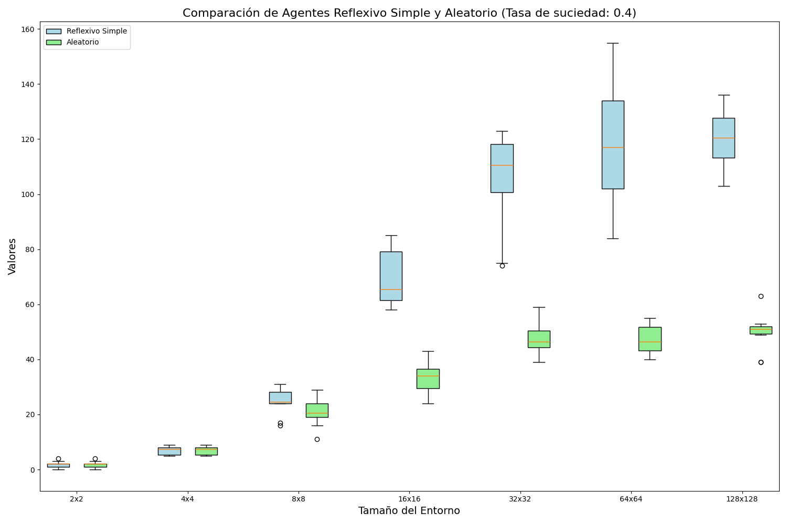
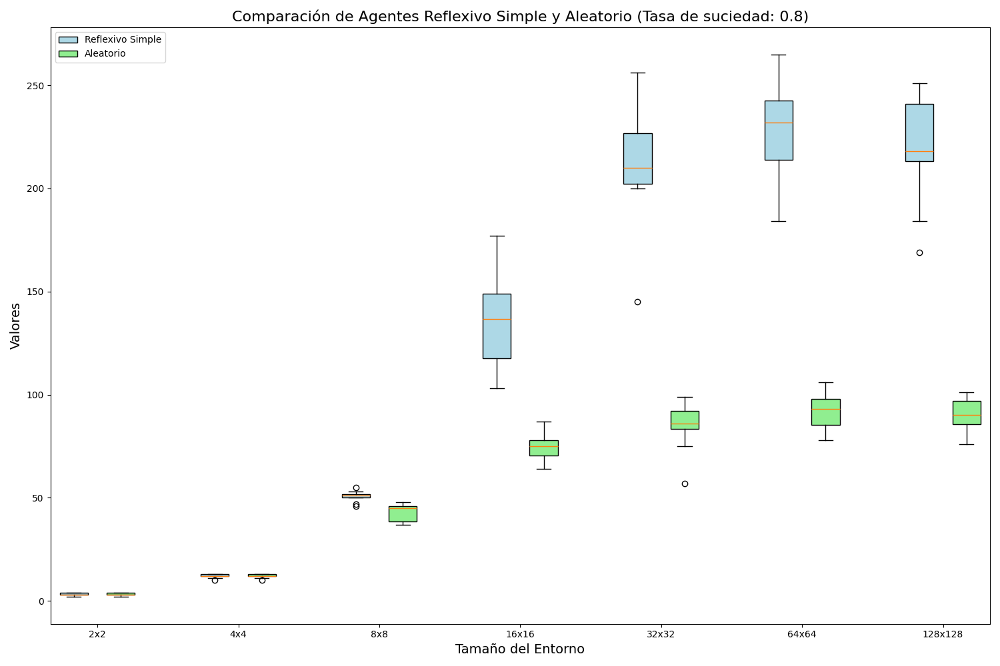

# INFORME TP2 AGENTES RACIONALES
# FRANCISCO ALBA

## INTRODUCCIÓN

A través del siguiente trabajo se desea explorar el funcionamiento de los agentes inteligentes en el campo de la inteligencia artificial. Concretamente, se hace hincapié en un tipo particular de agente inteligente denominado agente racional, y en su interacción con un entorno determinado.

### MARCO TEÓRICO 

Al utilizar la palabra "inteligente" en el marco de la inteligencia artificial hacemos referencia en realidad al estudio de una forma racional de actuar. Llamamos entonces "agente racional" a un software capaz de percibir información de su entorno y de accionar o no en consecuencia, y lo calificamos específicamente como "racional" debido al hecho de que toma la decisión "correcta" en cada oportunidad. Tomar la decisión "correcta" está relacionado con el efecto que tienen las acciones del agente en el estado de su entorno, y con el carácter de deseable o no que tenga ese efecto. Este concepto de "deseabilidad" entonces está capturado por la idea de una medida de rendimiento qué evalúa cualquier secuencia de estados del entorno donde se desempeña el agente.

Consideramos así la siguiente definición de **agente racional**:

> Para cada secuencia posible de percepciones, un agente racional es aquel que selecciona la acción que se espera que maximize su medida de rendimiento, basándose en la evidencia provista por la secuencia de percepciones y en cualquier otro conocimiento previo.

### DISEÑO EXPERIMENTAL

El experimento consiste en crear un simulador para un ejemplo tradicional en el área de estudio que permite ilustrar el funcionamiento de los agentes racionales y sus propiedades. El ejemplo en cuestión consta de una aspiradora imaginaria dentro de una cuadrícula que hace las veces de entorno y en la cual se simula la presencia de suciedad. La aspiradora sólo puede percibir el estado de su ubicación actual (es decir, si está sucia o no) y su posición, y con esa información puede o bien limpiar el casillero si está sucio o bien moverse a otro casillero en alguna dirección permitida. Como características principales, se dice que el entorno en cuestión es parcialmente observable (los sensores de la aspiradora sólo proveen información respecto del casillero donde se encuentra la misma, no de todos los casilleros) y también determinístico (su próximo estado depende únicamente del estado actual y de la acción ejecutada por el agente).

En relación al entorno, se contemplan además las siguientes restricciones:

1. La medida de rendimiento premia con un punto al agente por cada recuadro que limpia (o aspira) en un período de tiempo concreto, a lo largo de una "vida" de 1000 acciones.
2. La dimensión de la grilla se conoce a priori pero la distribución de la suciedad y la localización inicial del agente no se conocen (son aleatorios).
3. Las cuadrículas se mantienen limpias y al aspirar se limpia la cuadrícula en la que se encuentra el agente.
4. El agente percibe su ubicación y si esta contiene suciedad.
5. Las acciones permitidas son: Arriba, Abajo, Izquierda, Derecha, Limpiar (ó Aspirar) y NoHacerNada.
6. Las acciones Izquierda, Derecha, Arriba, Abajo mueven al agente en dichas direcciones, excepto en el caso en que lo puedan llevar fuera de la grilla.

Las pruebas se realizan para dos tipos de agentes, un **agente reflexivo simple** (que comprueba si la ubicación actual está sucia, en cuyo caso la limpia, y que en caso de no estarlo se mueve aleatoriamente en una de las cuatro direcciones posibles) y un **agente totalmente aleatorio** (que para cada acción posible, elige aleatoriamente entre moverse a algún casillero ó limpiar), para los cuales se contemplan en total siete dimensiones de cuadrícula (2×2, 4×4, 8×8, 16×16, 32×32, 64×64, 128×128) y cuatro tasas de suciedad de las mismas (0.1, 0.2, 0.4, 0.8).

Para una combinación determinada de los parámetros descriptos (por ejemplo, tasa de suciedad 0.1 con dimensión de cuadrícuña 2x2), se repite el procedimiento 10 veces con cada tipo de agente teniendo presente que para dichas pruebas el entorno se encuentre inicializado de igual forma (es decir, que la suciedad esté ubicada en los mismos casilleros), a fin de poder comparar posteriormente el rendimiento de ambos.

### ANÁLISIS Y DESCRIPCIÓN DE RESULTADOS

A continuación se presentan los resultados obtenidos expresados en forma gráfica, en donde los primeros cuatro gráficos (uno para cada tasa de suciedad) dan nota de la clara diferencia de rendimiento entre el agente reflexivo simple y el agente completamente aleatorio, siendo la de éste último la que peor se desempeña a medida que aumenta el tamaño de la cuadrícula. A fin de mejorar la legibilidad de los datos, se optó por tomar el promedio de la medida de rendimiento de las 10 ejecuciones del agente para cada tamaño de cuadrícula:

Los siguientes cuatro gráficos, por otro lado, representan el gráfico de cajas y extensiones para la totalidad de los 10 datos recolectados para cada agente y cada tamaño de entorno, permitiendo comparar el nivel de variabilidad en el rendimiento de los distintos tipos de agentes:

### CONCLUSIÓN

Si bien la diferencia en el rendimiento de cada tipo de agente (el reflexivo simple comparado con el totalmente aleatorio) es importante, no resulta algo sorprendente, ya que tiene sentido pensar que el agente realizará acciones "de más" al existir la posibilidad de que, para un momento dado, encontrándose en un casillero "sucio", el agente pueda tomar la decisión de no limpiar dicho casillero y en su lugar moverse a otro. Esto se hace más aún evidente en las cuadrículas de mayor tamaño, donde para una misma cantidad de acciones a realizar (en todos los casos los agentes ejecutan 1000 acciones) y al ser mucho mayor la cantidad de posibles cuadrículas "sucias", se acentúa la diferencia en la medida de rendimiento, como puede observarse correctamente en los gráficos presentados.

Resulta curioso resaltar además que, dado que la cantidad de acciones que pueden realizar los agentes tiene un tope superior de 1000 acciones, a partir de un cierto tamaño de cuadrícula el rendimiento comienza a decrecer. Esto puede observarse en el gráfico de líneas para la tasa de suciedad con valor 0.8.
