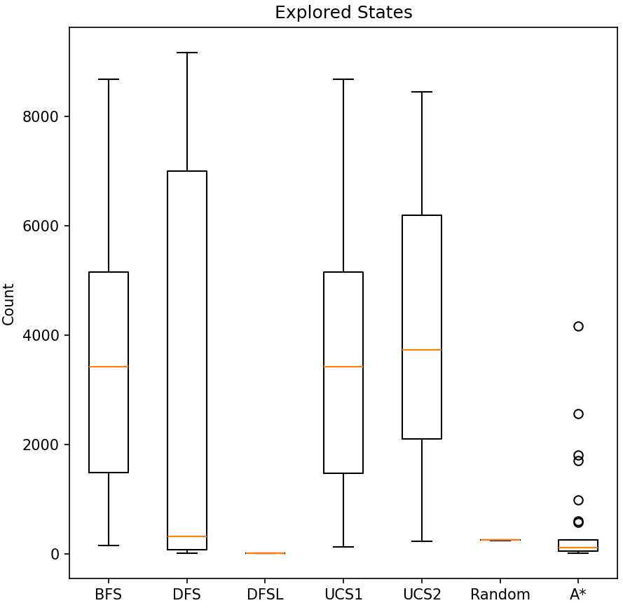
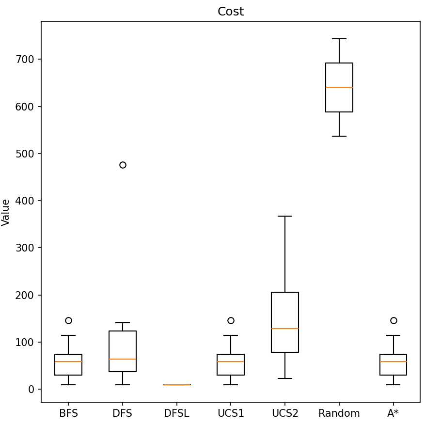
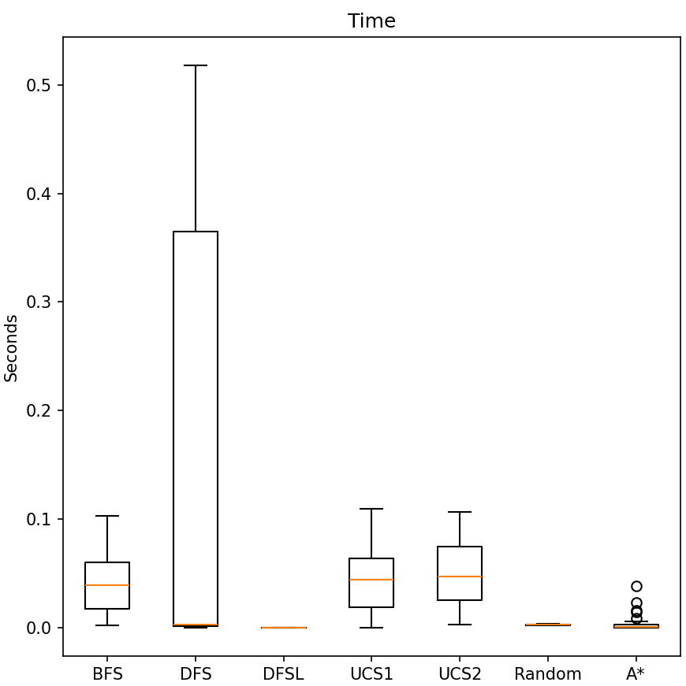

# INFORME TP3y4:
# BÚSQUEDAS NO INFORMADAS E INFORMADAS

## **INTRODUCCIÓN**

En el presente informe comparamos el rendimiento entre distintos algoritmos de búsqueda no informada, así como del algoritmo de búsqueda informada denominado "A*" (a estrella).

### **MARCO TEÓRICO** 

### Algoritmos de búsqueda no informada

Los algoritmos de búsqueda no informada exploran el espacio de estados sin información adicional sobre el problema más allá de la definición del mismo. Estos algoritmos no utilizan conocimiento específico del dominio para guiar la búsqueda hacia el objetivo.
#### Principales algoritmos de búsqueda no informada:

1. Búsqueda en amplitud (BFS)
2. Búsqueda en profundidad (DFS)
3. Búsqueda de costo uniforme (UCS)
4. Búsqueda en profundidad limitada (DFSL)
#### Tabla comparativa de costes temporales y espaciales

|Algoritmo|Coste temporal|Coste espacial|
|---|---|---|
|BFS|O(b^d)|O(b^d)|
|DFS|O(b^m)|O(bm)|
|UCS|O(b^(1 + ⌊C*/ε⌋))|O(b^(1 + ⌊C*/ε⌋))|
|Profundidad limitada|O(b^l)|O(bl)|
|IDS|O(b^d)|O(bd)|
Donde:
- b: factor de ramificación
- d: profundidad de la solución más superficial
- m: profundidad máxima del árbol de búsqueda
- C*: costo de la solución óptima
- ε: diferencia mínima entre costos de paso
- l: límite de profundidad
### Algoritmo de búsqueda informada A*

A* es un algoritmo de búsqueda informada que utiliza una función heurística para estimar el costo desde un nodo hasta el objetivo. Combina el costo real del camino desde el inicio hasta el nodo actual (g(n)) con una estimación heurística del costo desde el nodo actual hasta el objetivo (h(n)).

La función de evaluación de A* es:

f(n) = g(n) + h(n)

Donde:
- f(n): valor de evaluación total del nodo n
- g(n): costo real del camino desde el inicio hasta n
- h(n): estimación heurística del costo desde n hasta el objetivo
#### Admisibilidad de la heurística

Una heurística es admisible si nunca sobreestima el costo real para alcanzar el objetivo. En otras palabras, para todo nodo n:

h(n) ≤ h*(n)

Donde h*(n) es el costo real del camino óptimo desde n hasta el objetivo.

La admisibilidad garantiza que A* encontrará una solución óptima si existe.
#### Consistencia de la heurística

Una heurística es consistente (o monótona) si, para cada nodo n y cada sucesor n' de n generado por una acción a, el costo estimado de alcanzar el objetivo desde n no es mayor que el costo de ir de n a n' más el costo estimado de alcanzar el objetivo desde n':

h(n) ≤ c(n, a, n') + h(n')

Donde c(n, a, n') es el costo de la acción a.

La consistencia implica admisibilidad y garantiza que A* nunca necesitará reabrir nodos cerrados, lo que mejora su eficiencia.

#### Desigualdad triangular

El concepto de consistencia está estrechamente relacionado con la desigualdad triangular en matemáticas. La desigualdad triangular establece que la suma de las longitudes de dos lados de un triángulo siempre debe ser mayor o igual que la longitud del tercer lado.

En el contexto de las heurísticas, la desigualdad triangular se aplica de la siguiente manera:

h(n) ≤ d(n, n') + h(n')

Donde:

- h(n) es la estimación heurística desde el nodo n hasta el objetivo
- d(n, n') es la distancia real entre los nodos n y n'
- h(n') es la estimación heurística desde el nodo n' hasta el objetivo

Esta desigualdad debe cumplirse para cualquier par de nodos n y n' en el espacio de búsqueda.

La relación entre la consistencia y la desigualdad triangular se puede entender de la siguiente manera:

1. La consistencia garantiza que el costo estimado para llegar al objetivo nunca aumenta más que el costo real de moverse de un nodo a otro.
2. La desigualdad triangular asegura que el camino directo entre dos puntos (en este caso, la estimación heurística) nunca es mayor que la suma de los caminos indirectos (el costo real más la estimación desde el siguiente nodo).

Cuando una heurística satisface la desigualdad triangular, se considera consistente. Esto tiene implicaciones importantes para el rendimiento y la optimalidad del algoritmo A*, ya que:

- Garantiza que los valores de f(n) a lo largo de cualquier camino son no decrecientes.
- Asegura que cuando A* expande un nodo, ya ha encontrado el camino óptimo a ese nodo.
- Permite que A* sea más eficiente, evitando la necesidad de reabrir nodos cerrados.

### **DISEÑO EXPERIMENTAL**

Para evaluar el desempeño de cada algoritmo, inicializamos el entorno "FrozenLake" de la librería gymnasium con un tamaño de 100x100 celdas, comportamiento determinista y con un valor de 0.08 correspondiente a la probabilidad de que una celda determinada resulte en un agujero. Definimos además que un agente puede dar como máximo 1000 pasos para encontrar el objetivo.

Con este entorno creado y empleando una semilla para garantizar la reproductibilidad de los resultados, consideramos para cada algoritmo 2 escenarios posibles: 
1. Uno en que cada acción tiene costo 1.
2. Y otro en que cada acción tiene un costo mayor en una unidad al valor asignado para dicho movimiento por el entorno. Por ejemplo, como la acción de moverse a la izquierda correponde al valor 0, asociamos entonces un costo de 1 a dicha acción.

Realizamos entonces un total de 30 pruebas para cada algoritmo, de las cuales buscamos obtener la cantidad de estados explorados para llegar a un objetivo (si fue posible llegar), el costo total de las acciones tomadas para llegar a esos objetivos y el tiempo total empleado en cada uno de los 30 recorridos. Estos resultados se presentan en gráficos de caja y extensiones.

### **ANÁLISIS Y DESCRIPCIÓN DE RESULTADOS**

En las siguientes 3 imágenes es posible observar los resultados obtenidos para cada algoritmo ejecutando un máximo de 1000 pasos. Las leyendas UCS1 y UCS2 hacen referencia a los algoritmos de búsqueda con costo uniforme, en los casos 1 y 2 descritos previamente en la sección de Diseño Experimental.

Figura 1

En la figura superior, se representa el número total de estados explorados. Es posible observar que los algoritmos BFS y UCS1 presentan resultados idénticos, así como que los algoritmos DFSL y Random prácticamente no exploran estados.

Figura 2

La Figura 2 permite observar el costo total de los caminos obtenidos por cada algoritmo, que llegan correctamente al objetivo. Notamos acá que para los algoritmos BFS, UCS1 y A* la distribución de los costos es la misma, que el algoritmo DFSL prácticamente no tiene valores debido a la limitación de profundidad establecida, y que el algoritmo Random obtiene los peores resultados de costo por mucha diferencia.

Figura 3

La Figura 3 indica el tiempo total empleado por las distintas iteraciones al intentar encontrar un objetivo. Ignorando el algoritmo de búsqueda en profundidad limitada (ya que siempre obtendrá un tiempo menor al resto por estar limitado su recorrido), es posible destacar el rendimiento del algoritmo A*, cuyos peores casos se mentienen por debajo de los 0.05s. El peor caso, por otro lado, es obtenido por el algoritmo DFS con una demora máxima de poco más de 0.5s, es decir, más de 10 veces el mayor tiempo de ejecución correspondiente al algoritmo A*.

### **CONCLUSIÓN**

Basándome en los datos analizados en los apartados anteriores, considero que el algoritmo de búsqueda informada A* resulta ser el más adecuado para resolver el problema, ya que, además de requerir la menor cantidad de estados visitados para llegar a un objetivo, es también aquel que logra encontrarlos en el menor tiempo posible. 

Por otro lado, los gráficos representados dan cuenta del mal rendimiento del algoritmo DFS, lo cual permite confirmar que la necesidad de recurrir a este algoritmo debe basarse estrictamente en una necesidad de optimizar el espacio en memoria utilizado y no el tiempo. 
